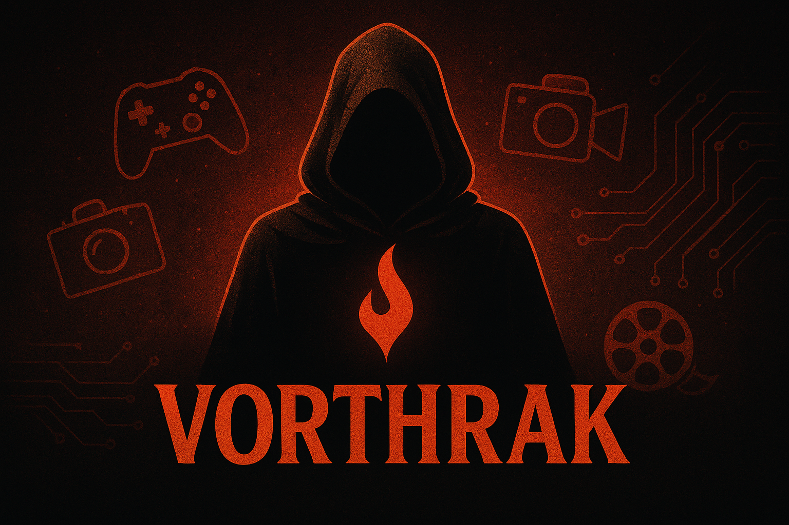

  

  

  <table width="100%" style="table-layout: fixed;">
    <tr>
      <td align="center" style="width: 50%; padding: 10px;">
        
          
        
      </td>
      <td align="center" style="width: 50%; padding: 10px;">
        
      </td>
    </tr>
  </table>

  

    <table style="width: 80%; table-layout: fixed;">
      <tr>
        <td style="text-align: center; vertical-align: middle; padding: 10px; width: 50%; padding-right: 10px;">
          

             
            
          

        </td>
        <td style="text-align: center; vertical-align: middle; padding: 10px; width: 50%; padding-left: 10px;">
          
        </td>
      </tr>
    </table>
  

  

    
  

  

  
  
  
  
  
  
  
  
  
  
  
  
  
  
  
  
  
  
  
  
  
  
  
  
  
  
  
  
  
  
  
  
  
  
  
  
  
  
  
  
  
  
  
  
  

